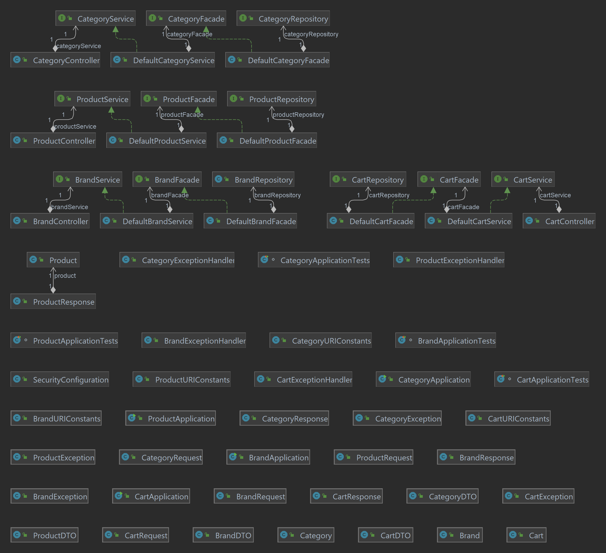
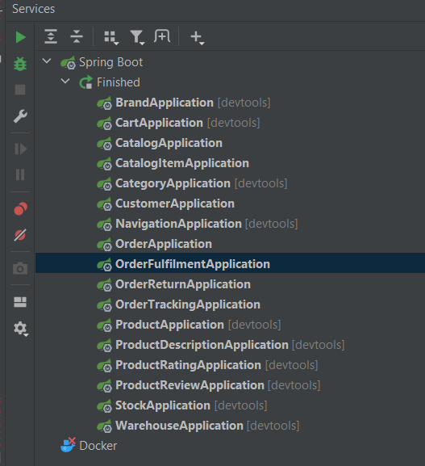

# Introduction:
My e-commerce proof of concept demo project well...
when I have a better intro I'll upddate this...
but to be honest this is project was supposed to be a
personal project 😂 😂

# Features:
    - brand serivice
    - cart service
    - category service
    - catalog service
    - catalog item service
    - customer service
    - navigation service
    - order fulfilment service
    - order return service
    - order service
    - order tracking service
    - product service
    - product rating service
    - product review service
    - product description service
    - stock service
    - warehouse service

# Technologies Used: 

🔘   Angular 17 - Web App  
🔘   Spring-Boot 3 Micro-Services  
🔘   Springframework 6  
🔘   Spring-Data  
🔘   Hikari Connection Pool  
🔘   Hibernate - ORM  
🔘   H2 Database  
🔘   Bootstrap 5 - UI  

# Domain Knowledge: 
Retail - Business to Customer (B2C)

# License: 

BSD 3-Clause License

# Contact:

Cell : +27 (0) 71 741 6469  
📧 e-mall : mandisamkhungo@live.com  

# Acknowledgments:  
- basic layout - bootstrap template  made by silvan paul

## Front-End - Angular 17 

..Pending ...

##  Back-End - Spring-boot 3 Microservices

